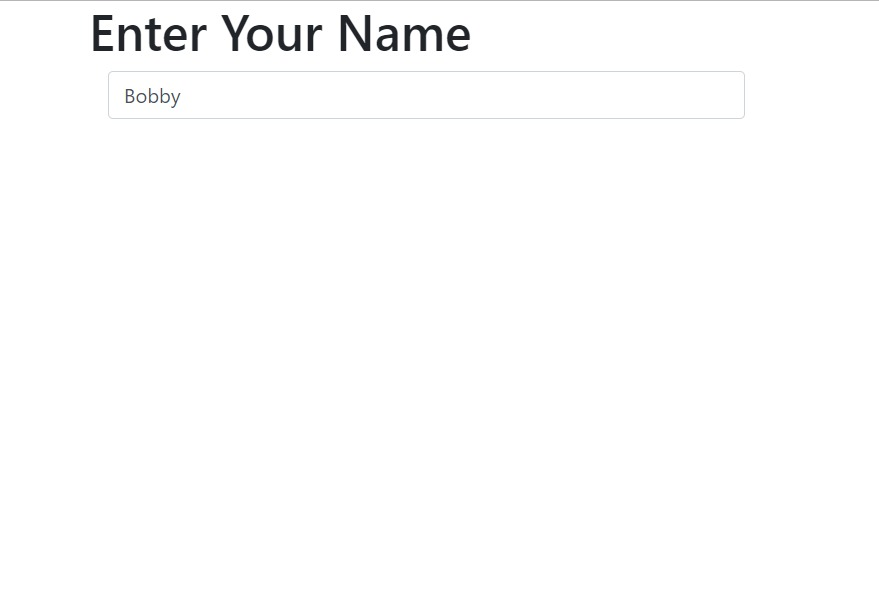
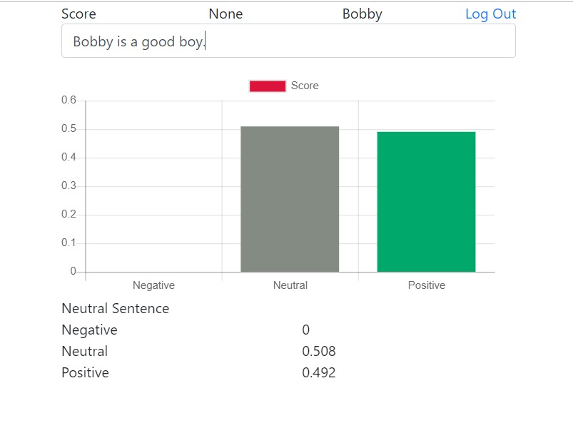
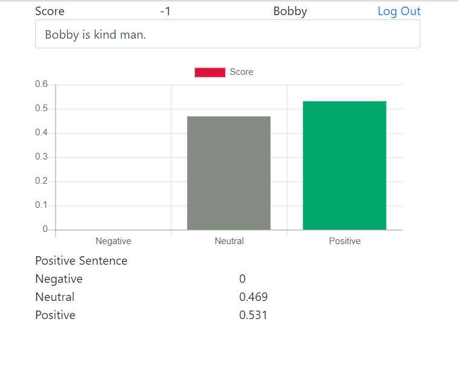
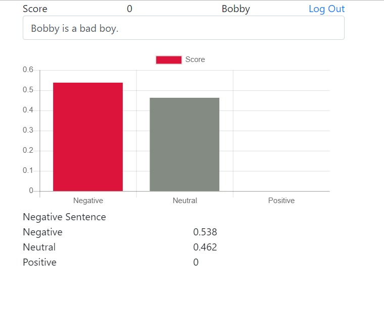
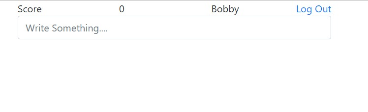

# WEB-VADER-SENTIMENT-ANALYZER
WEB based sentiment analyzer which predicts positive, neutral and negative emotion sentence and creates a MySQL database to store the result using FLASK, PYTHON, VADER, JAVASCRIPT, BOOTSTRAP, JAVASCRIPT.

MySQL Command to create user_score table
	
	CREATE TABLE user_score(
		name varchar(50),
		score varchar(50)
	);

Login Page of the webapp

Neutral sentences  

Positive sentences  

Negative sentences  

Display Score

